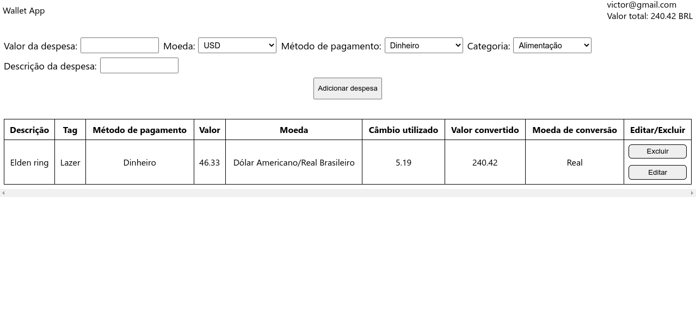

# Wallet App

## Introdução
Um projeto feito inteiramente por mim.

É uma aplicação em que é possível genrenciar as suas despesas, sejam elas mensais ou anuais.

## Como utilizar
Primeiramente, na tela de login, coloque um email válido e uma senha com 6 ou mais caracteres. Esse login não serve pra nada. Só é enfeite mesmo :).

Na página de despesas, é possível colocar uma despesa, obviamente. É possível colocar o valor, moeda, método de pagamento, categoria e descrição da despesa.

Bem simples de se usar, só precisa saber ler.

## Link do projeto
https://wallet-app-delta.vercel.app/

## Imagens do projeto

